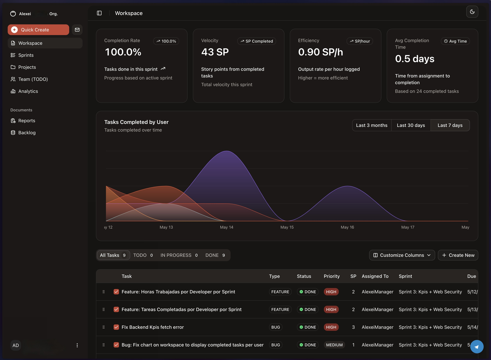
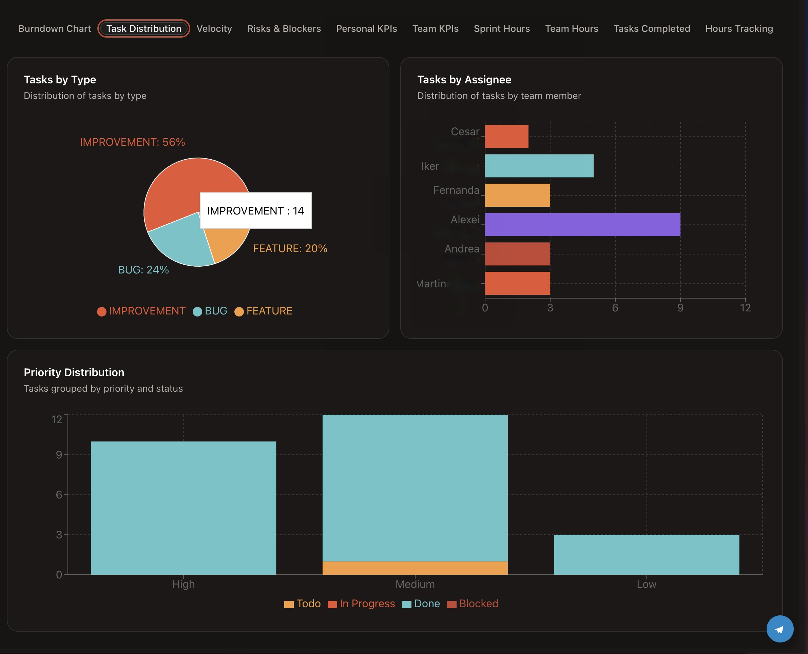
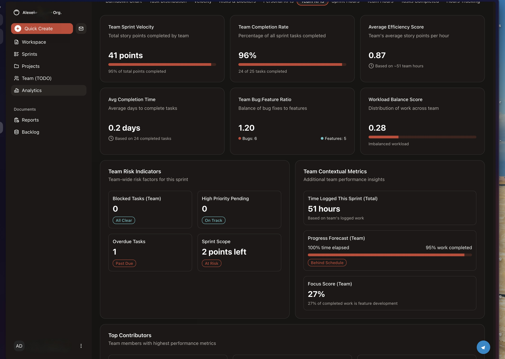

# Project Management Application on OCI

## Showcase
Dashboard Showcase

Kpi Dashboard Task Distribution Section

Kpi Metrics Distribution

<!-- Example:  -->

## Overview
This repository hosts a comprehensive project management application designed to facilitate task tracking, project organization, team collaboration, sprint management, and performance monitoring through team-based and individual KPIs. The application features a modern user interface accessible via a web application and a Telegram bot for on-the-go interactions.

A primary goal of this project was to gain hands-on experience with Oracle Cloud Infrastructure (OCI) and a modern DevOps toolchain, including HCL Terraform, Docker, and Kubernetes.

## Collaboration with Oracle
This project was developed in close collaboration with Oracle, adhering to their specifications and best practices. It served as a learning platform to explore and implement solutions using Oracle Cloud services and to understand the intricacies of deploying and managing cloud-native applications.

## Architecture
The application is built upon a microservices architecture to ensure scalability, resilience, and maintainability. It employs the Backend for Frontends (BFF) pattern to provide tailored APIs for its different client applications.

*   **Microservices:** Core functionalities are broken down into independent, deployable services.
*   **Backends for Frontends (BFF):** Dedicated backend services cater to the specific needs of the web application and the Telegram bot.
*   **Clients:**
    *   **Web Application:** A rich, interactive interface for comprehensive project management.
    *   **Telegram Bot:** Allows users to interact with the system, receive notifications, and perform quick actions.

## Features
*   **Task Tracking:** Create, assign, and monitor the status of tasks.
*   **Project Management:** Organize projects, set milestones, and manage timelines.
*   **Team Management:** Define teams, assign roles, and manage team members.
*   **Sprint Management:** Plan and execute agile sprints.
*   **KPI Tracking:** Monitor key performance indicators for both teams and individuals to measure productivity and success.

## Technology Stack
*   **Backend:**
    *   Java 17
    *   Spring Boot
*   **Frontend:**
    *   Next.js 15
*   **Database:**
    *   Oracle Database (as evidenced by JDBC connection strings in deployment configurations)
*   **Cloud & DevOps:**
    *   Oracle Cloud Infrastructure (OCI)
    *   Docker for containerization
    *   Kubernetes for container orchestration
    *   HCL Terraform for infrastructure as code
    *   CI/CD pipeline for automated builds and deployments on OCI

## Learning Objectives & Cloud Tools
This project was specifically undertaken to deepen understanding and practical skills in:
*   **Oracle Cloud Infrastructure (OCI):** Leveraging various OCI services for hosting, database management, and networking.
*   **CI/CD Pipelines:** Implementing automated build, test, and deployment processes.
*   **Microservices Architecture:** Designing and developing a distributed system.
*   **Containerization & Orchestration:** Using Docker and Kubernetes for deploying and managing application services.
*   **Infrastructure as Code:** Managing cloud resources using HCL Terraform.

## Evolution from `oci-react-samples`
This project was initially forked from the `oracle/oci-react-samples` repository (specifically, the `mtdrworkshop` which used a Java/Helidon backend). However, it has undergone significant architectural and structural transformations. Key changes include:
*   **Complete Backend Overhaul:** The backend was re-implemented using Spring Boot and Java 17, moving away from Helidon.io.
*   **Microservices Implementation:** The architecture was refactored into a microservices-based system.
*   **Frontend Modernization:** The frontend was developed using Next.js 15.
*   **Expanded Feature Set:** New features for comprehensive project management were introduced.

These changes reflect a deliberate effort to explore different technologies and architectural patterns within the Oracle Cloud ecosystem.